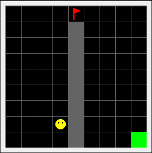

# irl-hierarchal-maxent-safe-exploration

implementation of softmax Maxmium Entropy algo for Inverse reinforcement learning to solve hierarchal tasks while ensuring safe exploration. used modified interface by Minimalistic gridworld environment for OpenAI Gym (https://github.com/maximecb/gym-minigrid).

example configuration for testing :

